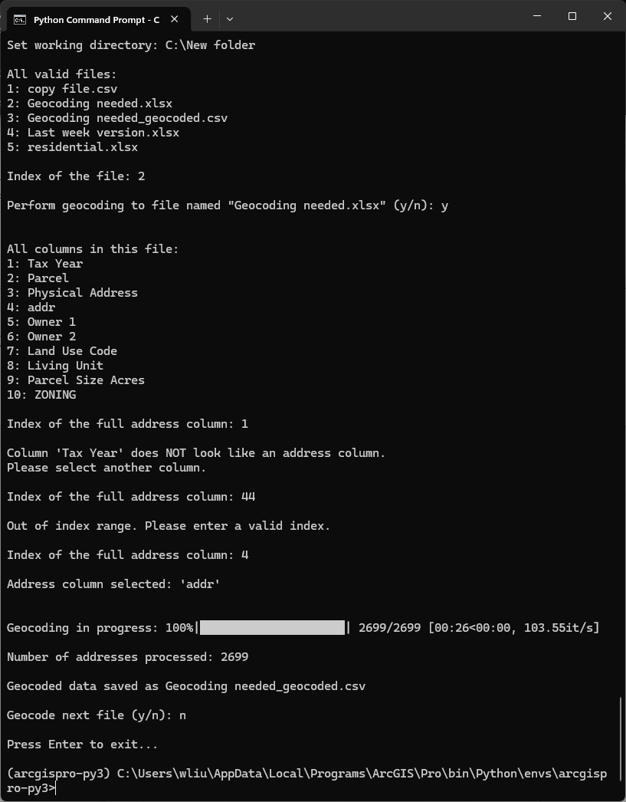

# Terminal Geocoder

**Terminal Geocoder** is a geocoding tool designed to be used with ArcGIS Python Command Prompt, a dedicated command line utility included with ArcGIS Pro. The tool provides an interactive experience for users to do their own geocoding tasks through a straightforward approach.

## Requirements

- ArcGIS Pro (>3.0) is installed on your computer
- The data to be geocoded is in a CSV or Excel file (File name extension: .xlsx, .xls, or .csv)

## Use the tool

**Step 1: Prepare your data/spreadsheet**

Create a single column that has the full address, e.g., 123 Main St., Chicago, IL 60601. Skip this step if there exists a column for the full address already, or if the file is a CSV.

**Step 2: Run script**

Open ArcGIS Python Command Prompt. Run the Python Script.

For example:

```shell
(arcgispro-py3) C:\Users\wliu\AppData\Local\Programs\ArcGIS\Pro\bin\Python\envs\arcgispro-py3>python "RunGeocoding.py"
```

_Note: It may take a while before the program starts. (Just like when you wait for ArcGIS Pro to open!)_

**Step 3: Start Geocoding**

Follow the instructions to perform geocoding step by step.

For example:


